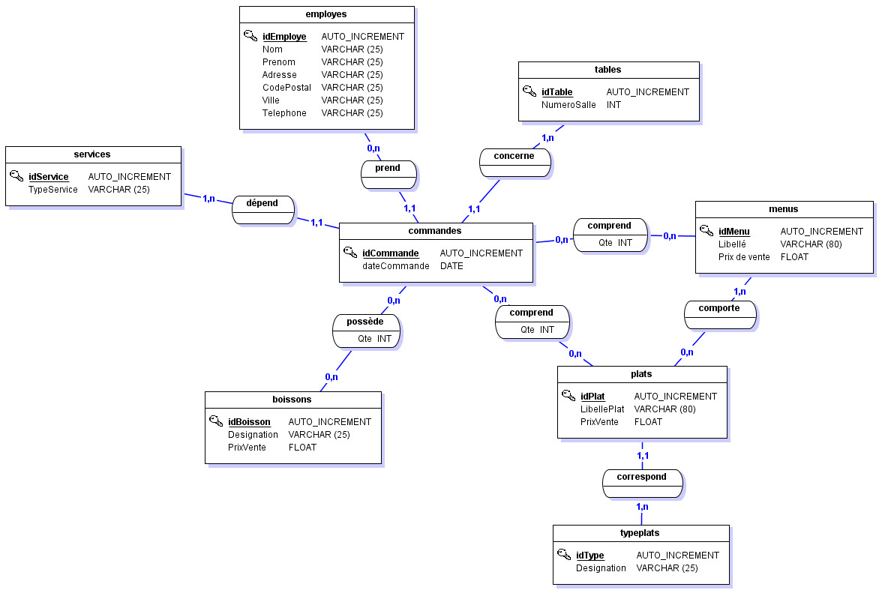
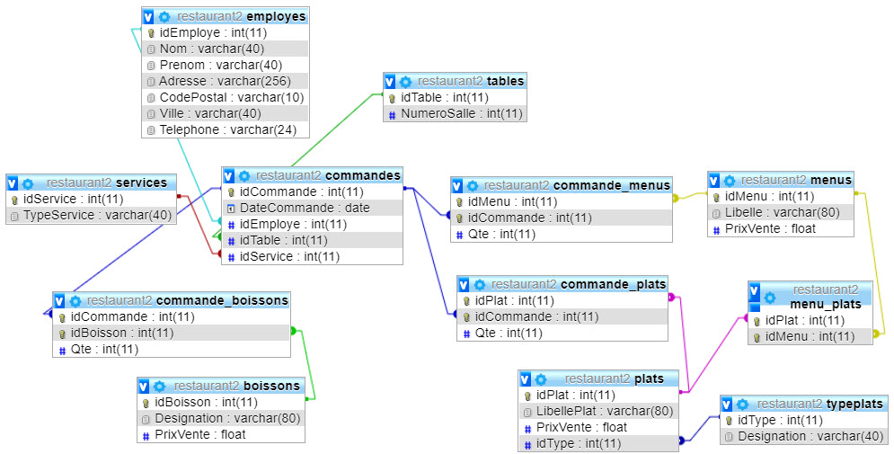
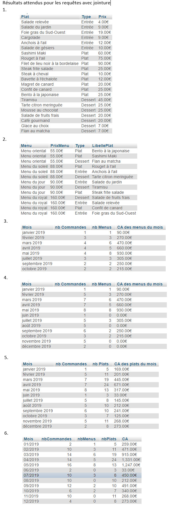

# SQL : Exercices de requêtage
  
## Etape 1 : Préparons notre base

Vous allez travailler sur la base de données d'un restaurant, dont voici le MCD :

Pour commencer, créez une base de données MySql et importer le script suivant : [restaurant.sql](restaurant.sql)

Profitez-en pour regarder les requêtes utilisées ...

Vous devez obtenir le schéma physique suivant (ici, grâce au concepteur de PhpMyAdmin) :

## Etape 2 : premières requêtes unitaires

Ecrivez les requêtes SQL qui répondent aux demandes ci-dessous, toutes les requêtes doivent être unitaire, c'est à dire porter sur une seule table sans jointure ni sous-requête :

    1. Lister les commandes de la table n°10, les trier par date chronologique (SELECT WHERE ORDER BY)

    2. Liste les commandes de la table n°10 ou n°6 pour le service du midi (AND, OR IN)

    3. Afficher le nb de commandes passé à la table n°10 (COUNT et AS)

    4. Afficher le nb de commande passé à la table n°10, pour chacun des services midi et soir (GROUP BY)

    5. Reprendre la requête précédente et remplacer l'id du service par Midi ou Soir (CASE WHEN)

    6. Afficher les commandes à venir, les trier par date anti-chronologique (NOW) 

    7. Afficher les commandes du dernier trimestre 2019 (YEAR, MONTH)

    8. Reprendre la requête précédente et remplacer la date de commande par le mois et l'année : octobre 2019 (DATE_FORMAT)

    9. Afficher le nb de commandes total pour chaque mois de l'année 2019

    10. Reprendre la requête précédente en n'affichant que les mois pour lesquels il y a au moins 5 commandes (HAVING)

## Etape 3 : sous-requêtes

Ecrivez les requêtes SQL qui répondent aux demandes ci-dessous, cette fois vous aurez besoin de sous-requêtes :

    1. Lister les noms des employés qui n'ont pris aucune commande

    2. Lister les noms des employés qui ont pris plus de 5 commandes en 2019

    3. Lister les noms des boissons qui n'ont jamais été commandées

    4. Afficher le nom des boisson qui ont été commandées au moins 10 fois

## Etape 4 : jointures

Ecrivez les requêtes SQL qui répondent aux demandes ci-dessous, exclusivement avec de belles jointures :

    1. Afficher la liste des plats avec comme colonnes : "Plat", "Type" et "Prix" (utilisez des alias)

    2. Afficher chaque menu avec la liste de chaque plat avec son type, ordonné par prix

    3. Afficher pour chaque mois de 2019, le nb de menus commandés et le CA que cela représente

    4. Afficher aussi les commandes pour lesquels aucun menu n’a été commandé (LEFT JOIN)

    5. Afficher la même chose pour les plats à la carte

    6. Afficher pour chaque mois de 2019 le CA total hors boisson (menu + plat à la carte)

Vérifier les résultats de vos requêtes (noms de colonnes y compris ):

